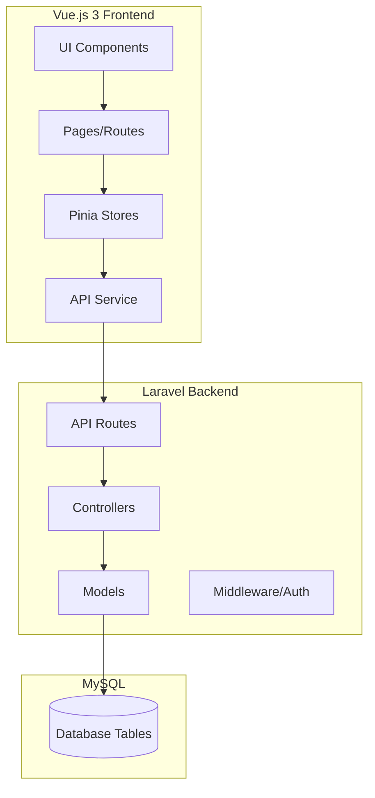

# OAX FASHION - Luxury E-Commerce Platform Implementation Plan

## Executive Summary

This plan outlines the comprehensive development of OAX FASHION, a luxury fashion e-commerce platform using Laravel (backend) and Vue.js 3 with Composition API (frontend), with Tailwind CSS v4 for styling. The implementation follows a design-system-first approach based on the inspiration files in the `/inspiration` directory.

---

## Design System Specifications (from Inspiration Analysis)

### Color Palette

| Token                        | Hex Code  | Usage                              |
| ---------------------------- | --------- | ---------------------------------- |
| `primary` / `oax-blood`      | `#8B0000` | Primary brand color, CTAs, accents |
| `primary-light`              | `#d41111` | Lighter variant for hover states   |
| `background-dark`            | `#181111` | Main dark background               |
| `surface-dark`               | `#221010` | Card/panel backgrounds             |
| `oax-dark`                   | `#181111` | Header/nav background              |
| `oax-panel`                  | `#271c1c` | Input/form backgrounds             |
| `border-dark` / `oax-border` | `#392828` | Borders and dividers               |
| `text-muted`                 | `#b99d9d` | Secondary text, placeholders       |
| `gold` / `accent-gold`       | `#D4AF37` | Luxury accent, ratings, highlights |
| `white`                      | `#FFFFFF` | Primary text on dark               |
| `black-rich`                 | `#000000` | Deep black                         |

### Typography System

| Element            | Font             | Weights |
| ------------------ | ---------------- | ------- |
| Headings (H1-H6)   | Playfair Display | 400-900 |
| Body Text          | Manrope          | 200-800 |
| UI Elements / Data | Manrope          | 400-700 |
| Prices             | Manrope          | 600-800 |

### Spacing & Layout

- Max container width: `1440px`
- Content padding: `px-4 md:px-10 lg:px-16`
- Grid: 12-column system
- Aspect ratios: `3/4` for product images

### Component Styles

- Border radius: `0.25rem` (sm), `0.5rem` (lg), `0.75rem` (xl), `full` (rounded-full)
- Buttons: Rounded-full for primary, rounded-lg for secondary
- Cards: `rounded-lg` with subtle borders
- Shadows: `shadow-lg`, `shadow-xl` with red tint for luxury feel

---

## Database Schema Design

### Required Tables (Laravel Migrations)

```
1. users
   - id, name, email, password, role (enum: customer, admin), avatar, phone, created_at, updated_at

2. addresses
   - id, user_id (FK), type (shipping/billing), first_name, last_name, address_line1, address_line2, city, state, postal_code, country, is_default, created_at, updated_at

3. categories
   - id, name, slug, description, parent_id (self-ref), image, sort_order, created_at, updated_at

4. products
   - id, sku, name, slug, description (rich text), category_id (FK), price, compare_price, material, care_instructions, status (draft/active), featured, created_at, updated_at

5. product_images
   - id, product_id (FK), image_url, alt_text, sort_order, created_at, updated_at

6. product_variants
   - id, product_id (FK), size, color, color_hex, sku, price, compare_price, inventory_qty, weight, created_at, updated_at

7. inventory
   - id, product_id (FK), product_variant_id (FK), quantity, reserved_qty, low_stock_threshold, last_restocked_at, created_at, updated_at

8. orders
   - id, order_number, user_id (FK), status (enum), subtotal, shipping_cost, tax, total, shipping_address (JSON), billing_address (JSON), notes, created_at, updated_at

9. order_items
   - id, order_id (FK), product_id (FK), product_variant_id (FK), quantity, unit_price, total_price, created_at, updated_at

10. payments
    - id, order_id (FK), payment_method, transaction_id, amount, status, metadata (JSON), created_at, updated_at

11. wishlists
    - id, user_id (FK), product_id (FK), created_at, updated_at

12. reviews
    - id, product_id (FK), user_id (FK), rating (1-5), title, comment, verified_purchase (bool), status, created_at, updated_at

13. loyalty_accounts
    - id, user_id (FK), points_balance, tier (silver/gold/platinum), lifetime_spent, created_at, updated_at

14. loyalty_transactions
    - id, loyalty_account_id (FK), points, type (earn/redeem), description, order_id (FK nullable), created_at, updated_at
```

---

## API Endpoints Structure

### Authentication

- `POST /api/auth/register` - User registration
- `POST /api/auth/login` - User login
- `POST /api/auth/logout` - User logout
- `GET /api/auth/user` - Get authenticated user

### Products

- `GET /api/products` - List products (with filters, pagination)
- `GET /api/products/{slug}` - Get product details
- `GET /api/products/featured` - Get featured products
- `GET /api/products/search` - Search products

### Categories

- `GET /api/categories` - List categories
- `GET /api/categories/{slug}` - Get category with products

### Cart

- `GET /api/cart` - Get user's cart
- `POST /api/cart/add` - Add item to cart
- `PUT /api/cart/update/{id}` - Update cart item
- `DELETE /api/cart/remove/{id}` - Remove cart item

### Orders

- `GET /api/orders` - List user's orders
- `GET /api/orders/{id}` - Get order details
- `POST /api/orders` - Create new order
- `PUT /api/orders/{id}/status` - Update order status (admin)

### Wishlist

- `GET /api/wishlist` - Get user's wishlist
- `POST /api/wishlist/add` - Add to wishlist
- `DELETE /api/wishlist/remove/{id}` - Remove from wishlist

### Admin - Products

- `GET /api/admin/products` - List all products
- `POST /api/admin/products` - Create product
- `PUT /api/admin/products/{id}` - Update product
- `DELETE /api/admin/products/{id}` - Delete product

### Admin - Orders

- `GET /api/admin/orders` - List all orders
- `GET /api/admin/orders/{id}` - Get order details
- `PUT /api/admin/orders/{id}` - Update order

### Admin - Customers

- `GET /api/admin/customers` - List customers
- `GET /api/admin/customers/{id}` - Get customer profile

---

## Frontend Page Structure (Vue.js 3)

### Customer Pages

1. **Homepage** (`/`)
    - Hero section with video/image background
    - Featured collections grid (3 cards)
    - Brand philosophy section
    - New arrivals carousel
    - Editorial section with image
    - Instagram feed grid
    - Footer with newsletter signup

2. **Shop Page** (`/shop`, `/collections`)
    - Sidebar filters (categories, price range, sizes, colors)
    - Sort dropdown (featured, newest, price)
    - Product grid (3 columns desktop, 2 tablet, 1 mobile)
    - Grid/List view toggle
    - Pagination or infinite scroll

3. **Product Detail Page** (`/product/{slug}`)
    - Image gallery with thumbnails
    - Zoom on hover
    - Product info (name, price, reviews)
    - Color swatches
    - Size selector with size guide link
    - Quantity selector
    - Add to Cart / Buy Now buttons
    - Shipping info
    - Accordion sections (description, material, measurements)
    - Complete the Look section
    - Customer Reviews

4. **Shopping Cart** (`/cart`)
    - Slide-out drawer (mobile) / Full page (desktop)
    - Product list with thumbnails
    - Quantity controls
    - Remove item option
    - Move to wishlist
    - Order summary
    - Proceed to Checkout

5. **Checkout** (`/checkout`)
    - Multi-step flow (Shipping → Payment → Review)
    - Contact information form
    - Address form with validation
    - Shipping method selection
    - Payment method (Credit Card, Klarna, Afterpay)
    - Order review
    - Place Order

6. **Order Confirmation** (`/order/{id}`)
    - Success message
    - Order details summary
    - Continue shopping CTA

7. **User Account** (`/account`)
    - Dashboard with recent orders
    - Order history
    - Wishlist
    - Style profile questionnaire
    - Loyalty program section

8. **About Us** (`/about`)
9. **Contact** (`/contact`)
10. **Lookbook/Editorial** (`/lookbook`)

### Admin Dashboard Pages

1. **Overview** (`/admin`)
    - KPI cards (sales, orders, customers)
    - Charts (daily/weekly/monthly trends)
    - Top products list
    - Recent orders
    - Inventory alerts

2. **Products** (`/admin/products`)
    - Product list with filters
    - Add/Edit product form
    - Product variants management
    - Inventory tracking

3. **Orders** (`/admin/orders`)
    - Order list with status filters
    - Order detail view
    - Fulfillment workflow

4. **Customers** (`/admin/customers`)
    - Customer database
    - Customer segmentation

5. **Inventory** (`/admin/inventory`)
    - Stock levels
    - Low stock alerts

6. **Marketing** (`/admin/marketing`)
    - Email templates
    - Abandoned cart automation

7. **Analytics** (`/admin/analytics`)
    - Revenue trends
    - Tax calculations
    - Exportable reports

8. **Settings** (`/admin/settings`)

---

## Implementation Phases

### Phase 1: Design System Setup

- [ ] Configure Tailwind CSS v4 with custom theme
- [ ] Create `tailwind.config.js` with brand colors and fonts
- [ ] Set up CSS variables in `app.css`
- [ ] Create base components:
    - [ ] Button (primary, secondary, outline)
    - [ ] Input (text, email, select, textarea)
    - [ ] Card
    - [ ] Modal
    - [ ] Dropdown
    - [ ] Badge
    - [ ] Avatar
    - [ ] Spinner/Loader
    - [ ] Toast/Notification
    - [ ] Accordion
    - [ ] Tabs

### Phase 2: Database & Backend Migrations

- [ ] Create all migration files
- [ ] Run migrations
- [ ] Create database seeders with sample data

### Phase 3: Laravel Models & API Routes

- [ ] Create Eloquent models with relationships
- [ ] Create API controllers
- [ ] Set up API routes
- [ ] Implement authentication (Sanctum)

### Phase 4: Vue.js Frontend Setup

- [ ] Install Vue.js 3 with Vite
- [ ] Configure Pinia for state management
- [ ] Set up Vue Router
- [ ] Create API service layer
- [ ] Build layout components (Header, Footer)

### Phase 5: Customer-Facing Pages

- [ ] Homepage
- [ ] Shop/Collection page
- [ ] Product Detail page
- [ ] Cart (drawer + page)
- [ ] Checkout flow
- [ ] Account pages

### Phase 6: Admin Dashboard

- [ ] Admin layout
- [ ] Dashboard overview
- [ ] Product management
- [ ] Order management
- [ ] Customer management

### Phase 7: Authentication & State Management

- [ ] User registration/login
- [ ] Cart persistence
- [ ] Wishlist functionality
- [ ] Loyalty program integration

### Phase 8: Testing & Polish

- [ ] Responsive testing
- [ ] Performance optimization
- [ ] SEO improvements
- [ ] Bug fixes

---

## Technical Architecture Diagram



---

## File Structure

```
oax-fashion/
├── app/
│   ├── Http/
│   │   ├── Controllers/
│   │   │   ├── Api/
│   │   │   │   ├── AuthController.php
│   │   │   │   ├── ProductController.php
│   │   │   │   ├── CartController.php
│   │   │   │   ├── OrderController.php
│   │   │   │   ├── CategoryController.php
│   │   │   │   └── Admin/
│   │   │   │       ├── ProductController.php
│   │   │   │       ├── OrderController.php
│   │   │   │       └── CustomerController.php
│   │   ├── Middleware/
│   │   └── Requests/
│   ├── Models/
│   │   ├── User.php
│   │   ├── Product.php
│   │   ├── Category.php
│   │   ├── Order.php
│   │   ├── OrderItem.php
│   │   ├── Cart.php
│   │   ├── Wishlist.php
│   │   ├── Review.php
│   │   └── LoyaltyAccount.php
│   └── Providers/
├── database/
│   ├── migrations/
│   │   ├── 2024_01_01_000001_create_addresses_table.php
│   │   ├── 2024_01_01_000002_create_categories_table.php
│   │   ├── 2024_01_01_000003_create_products_table.php
│   │   ├── 2024_01_01_000004_create_product_images_table.php
│   │   ├── 2024_01_01_000005_create_product_variants_table.php
│   │   ├── 2024_01_01_000006_create_inventory_table.php
│   │   ├── 2024_01_01_000007_create_orders_table.php
│   │   ├── 2024_01_01_000008_create_order_items_table.php
│   │   ├── 2024_01_01_000009_create_payments_table.php
│   │   ├── 2024_01_01_000010_create_wishlists_table.php
│   │   ├── 2024_01_01_000011_create_reviews_table.php
│   │   ├── 2024_01_01_000012_create_loyalty_accounts_table.php
│   │   └── 2024_01_01_000013_create_loyalty_transactions_table.php
│   └── seeders/
├── resources/
│   └── js/
│       ├── app.js
│       ├── main.js
│       ├── components/
│       │   ├── ui/
│       │   │   ├── Button.vue
│       │   │   ├── Input.vue
│       │   │   ├── Card.vue
│       │   │   ├── Modal.vue
│       │   │   └── ...
│       │   ├── layout/
│       │   │   ├── AppHeader.vue
│       │   │   ├── AppFooter.vue
│       │   │   └── CartDrawer.vue
│       │   └── product/
│       │       ├── ProductCard.vue
│       │       ├── ProductGrid.vue
│       │       ├── ProductGallery.vue
│       │       └── ...
│       ├── pages/
│       │   ├── Home.vue
│       │   ├── Shop.vue
│       │   ├── ProductDetail.vue
│       │   ├── Cart.vue
│       │   ├── Checkout.vue
│       │   ├── account/
│       │   │   ├── Dashboard.vue
│       │   │   ├── Orders.vue
│       │   │   └── Wishlist.vue
│       │   └── admin/
│       │       ├── AdminLayout.vue
│       │       ├── Dashboard.vue
│       │       ├── Products.vue
│       │       └── Orders.vue
│       ├── stores/
│       │   ├── cart.js
│       │   ├── auth.js
│       │   ├── products.js
│       │   └── wishlist.js
│       ├── router/
│       │   └── index.js
│       └── services/
│           └── api.js
├── routes/
│   └── api.php
├── tailwind.config.js
└── vite.config.js
```

---

## Key Implementation Notes

1. **Design Fidelity**: Reference inspiration files in `/inspiration/` directory for exact colors, spacing, and component styles.

2. **State Management**: Use Pinia for:
    - Cart state (items, quantities, totals)
    - User authentication state
    - Product filters
    - Wishlist

3. **Responsive Design**: Mobile-first approach with breakpoints:
    - Mobile: < 640px
    - Tablet: 640px - 1024px
    - Desktop: 1024px - 1440px
    - Ultra-wide: > 1440px

4. **Performance**:
    - Lazy load images
    - Use Vue Suspense for async components
    - Implement virtual scrolling for large lists

5. **SEO**:
    - Server-side rendering where possible
    - Meta tags for each page
    - Structured data for products

---

## Next Steps

1. Begin Phase 1: Design System Setup
2. Configure Tailwind CSS with brand tokens
3. Create base UI components

Once the design system is established, proceed to database migrations and backend development.
